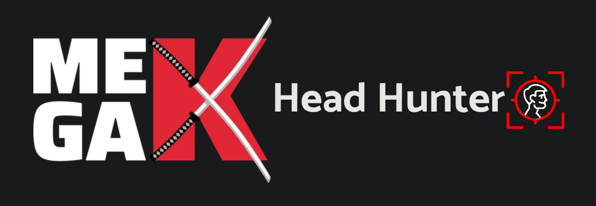

<div style="display: flex; align-items: center; justify-content: center">
<p align="center">


</div>
<p align="center">
  <a href="http://nestjs.com/" target="blank"></a>
</p>
<h1>MegaK Head Hunter </h1>

## Project currently in progres, will use technology:

### NestJS

### TypeScript

### MySQL

### TypeORM

### Swagger

### Docker

<br/>

---

## Newman test and reports based on PostMan collection:

### Run newman CLI report:

`newman run '.\Head Hunter.postman_collection.json'`

### Run newman HTML Extra report:

`newman run '.\Head Hunter.postman_collection.json' --reporter-htmlextra-export`

---

## Docker container:

` docker run -p 3000:8080 head-hunter-backend-docerized`

## Description

[Nest](https://github.com/nestjs/nest) framework TypeScript starter repository.

## Installation

```bash
$ npm install
```

## Running the app

```bash
# development
$ npm run start

# watch mode
$ npm run start:dev

# production mode
$ npm run start:prod
```

## Test

```bash
# unit tests
$ npm run test

# e2e tests
$ npm run test:e2e

# test coverage
$ npm run test:cov
```
